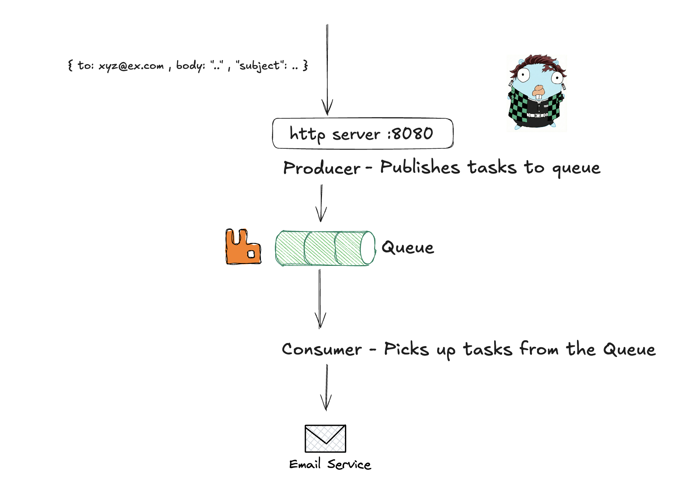

## learning RabbitMQ

this is a small project through which i learnt rabbitmq. the setup is quite simple:
- producer listens on HTTP port 8080, takes in the required payload, and publishes it to the queue.
- consumer listens to the queue and sends it to the destination using resend.

i have used it as a queue here, but in microservices it can be used as a message broker for async communication so that the client does not have to wait.

## requirements
- docker installed
- go 1.25.0

## instructions for running it

- create `.env` file using `.env.example`
- easy setup: run `make up` in the root
- if you want to run it outside of docker
    - start rabbitmq locally `make rabbit`
    - run `make run_producer` and `make run_consumer`
- finally to test it run `make send`
